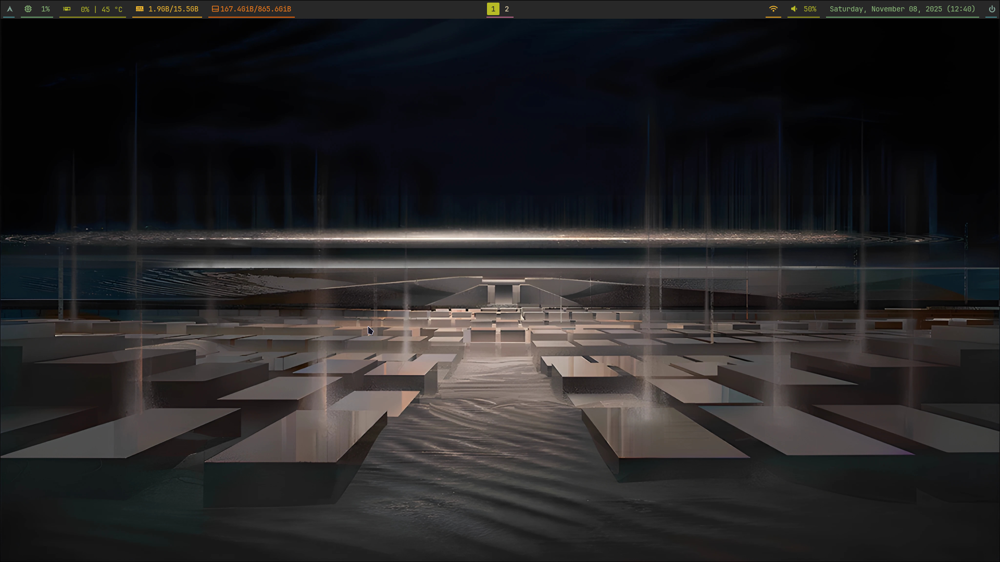
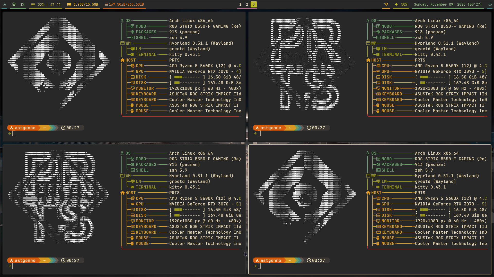
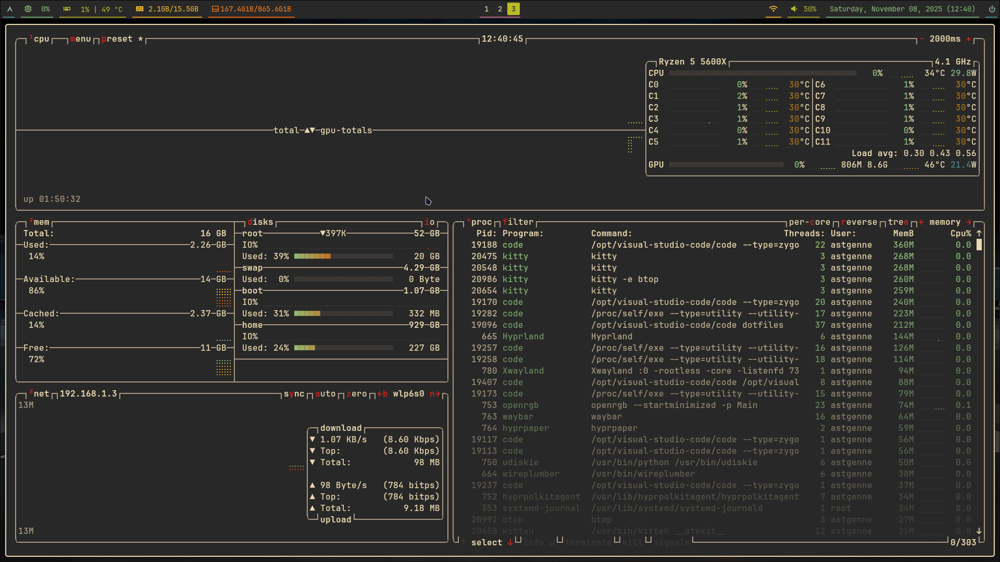
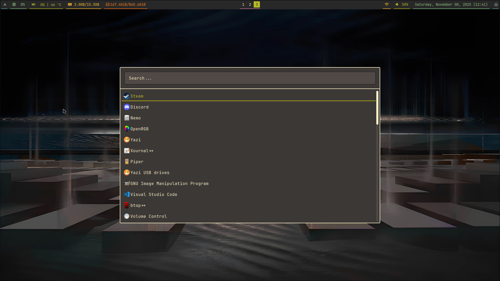
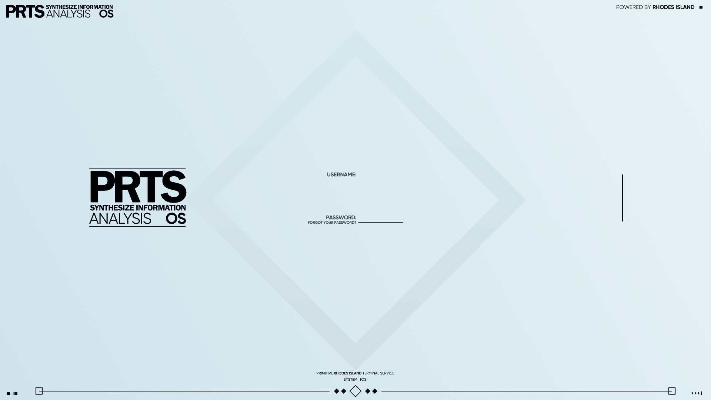

# Arch linux rice (with install script)

My personal Hyprland based Arch rice

## Table of Contents

1.  [Installation](#install-scripts)
2.  [Package list](#packages)
3.  [Gallery](#gallery)

## Install scripts

Assuming you have a fresh Arch install and have installed git, you can clone this repository in your home directory

`git clone https://github.com/Astgenne4922/dotfiles.git`

and launch the install script

`./install/install.sh`

This script executes in sequence 3 sub-scripts:

-   `aur.sh` to download and install `yay`
-   `git.sh` to setup git with your email and username
-   `packages.sh` to install all the rice's [packages](#packages) and setup the config files with `stow`

## Packages

### Shell

-   `zsh` for the default shell with the `zsh-autosuggestions` and `zsh-syntax-highlighting` plugins
-   `xdg-user-dirs` to setup the standard user directories (Desktop, Downloads, Pictures, ...)
-   `noto-fonts`, `ttf-opensans`, `ttf-jetbrains-mono-nerd`, `noto-fonts-emoji` and `noto-fonts-cjk` for the default fonts
-   `kitty` as the terminal emulator and `starship` for the shell prompt

### CMD Utilities

-   `fastfetch` to check system configuration
-   `btop` to check system statistics
-   `bat`, alternative to `cat` (aliased in `.zshrc` automatically to substitute cat)
-   `7zip`, file archiver
-   `curl` for http requests
-   `eza`, alternative to `ls` (aliased in `.zshrc` automatically to substitute ls)
-   `fd`, alternative to `find` (aliased in `.zshrc` automatically to substitute find)
-   `less` to read files
-   `man-db` for checking command documentation
-   `stow` symlink farm manager used to sync link this repo to the home directory
-   `tree` to list files recursively in folders
-   `dust` to check space usage
-   `ncdu`, interactive alternative to `dust`
-   `brightnessctl` for brightness control
-   `ddcutil` for monitor control
-   `wl-clipboard`, Wayland clipboard manager
-   `clipse`, tui clipboard manager
-   `gopac`, tui pacman/AUR manager

### Audio control

-   `wireplumber`, audio manager
-   `pavucontrol`, gui audio manager

### Text editors

-   `nvim` and `visual-studio-code-bin`

### File managers

-   `yazi` for a tui based one (with `ueberzugpp` to display images)
-   `nemo` for a gui one

### GTK theme

-   `Gruvbox-GTK-Theme` which requires `gnome-theme-extra`, `gtk-engine-murrine` and `sassc`

### Hyprland ecosystem

-   `hyprland`, wayland compositor
-   `hyprpaper`, wallpaper manager
-   `hyprlock`, lock screen manager
-   `hypridle`, idle manager
-   `hyprpolkitagent`, authentication agent
-   `hyprshot`, screenshot tool
-   `wlogout`, logout menu
-   `rose-pine-cursor`, cursor skin
-   `dunst`, notification deamon
-   `rofi`, application menu
-   `waybar`, wayland bar

### Multimedia management

-   `imv`, image viewer
-   `gimp`, image editor
-   `yt-dlp`, youtube download utility (requires `atomicparsley`)
-   `ffmpeg`, audio/video cmd editor
-   `termusic`, tui music player
-   `vlc`, video player
-   `zathura`, document viewer (with `zathura-pdf-mupdf` as backend)
-   `firefox`
-   `discord`
-   `xdg-desktop-portal-hyprland` for screen sharing on hyprland
-   `cameractrls`, webcam manager

### Greeter

-   `greetd`, login manager deamon
-   `greetd-tuigreet`, tui for greetd

## Gallery

### Desktop

(The wallpaper image is the "Hall of Stasis" from the game Arknights)

---

### Tiling windows

---

### Btop

---

### Rofi application menu (Super + Alt + Space)

---

### Keybinds helper using Rofi (Super + Shift + h)

---

### Lockscreen

The hyprlock config is entirely dependent on this image.

If you change it the lock interface will not make any sense

